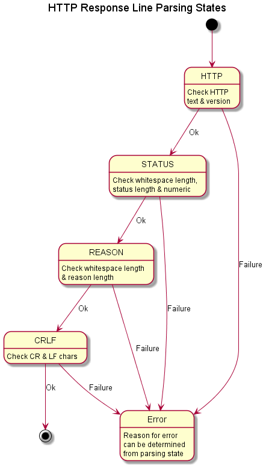
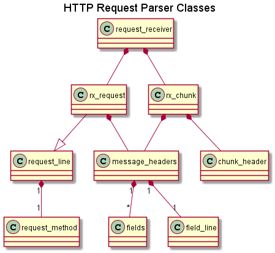
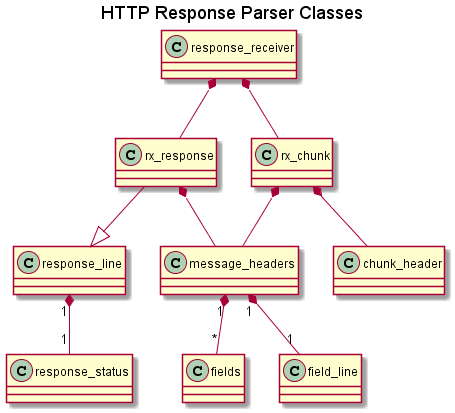
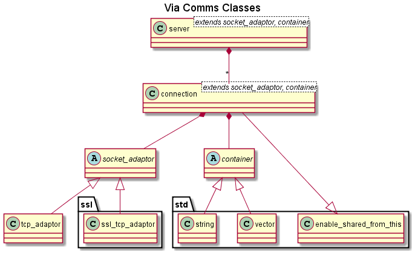

# Design #

The via-httplib library consists of three parts:  
* An HTTP parser/encoder in namespace via::http  
* Tcp and Ssl communications software in namespace via::comms  
* HTTP connection, server and client in namespace via  

The parser/encoder in via::http is completely independent of the communications
code in via::comms. They have been designed to provide a foundation for the
servers in the via namespace, but they can be used on their own if that is all
that’s required.

## The HTTP parsing/encoding library `via::http` ##

### Requirements ###

The Hypertext Transfer Protocol (HTTP) is a text based application level
messaging protocol.

A client sends a request message to a server to obtain or modify a resource.
A server sends a response message back to the client, either with the resource
or a reason why it hasn't responded as requested.

The protocol has three types of message:  
1.	A request, sent from a client to a server.  
2.	A response, sent from a server to a client.  
3.	A chunk, a chunk of data which may be part of a request or a response.  

And four types of header:  
1.	A request start line, e.g. GET /blah/blah HTTP/1.1\r\n  
2.	A response start line, e.g. HTTP/1.1 200 OK\r\n  
3.	A chunk start line, e.g. 2bf;\r\n  
4.	A message header, e.g. Content-Length: 336  

Although text based, the protocol is quite strict on what's allowed and what
isn't (see [rfc2616](http://www.w3.org/Protocols/rfc2616/rfc2616.html)).

A **request** message must always start with a request start line followed by any
number of message header lines and blank line. Some request messages may
contain data.

Likewise, a **response** message must always start with a response start line
followed by any number of message header lines and blank line. Also some
response messages may contain data.

Where a request or response message contains data in the body of the message,
it must have a **Content-Length** message header containing the size in octets
(another word for bytes) of the data. Otherwise, if the data is to be sent in
chunks, the request or response message must have a **Transfer-Encoding** message
header containing the word **Chunked**.

Where a request or response message contains chunked data, each chunk of data
must be preceded by a **chunk** header, which is just a line before the data with
the size of the data (in a hex string).

### Design  ###

For efficiency and simplicity, the request and response message parsers parse
the input data one character at a time. They keep track of their current
location with the HTTP message using a state machine so that they can handle
requests and responses where an HTTP message is divided across multiple
message packets.

The parsed message headers (for both requests and responses) are stored in a
map of strings. The message header field names are converted to lower case
whilst the message header is being parsed. rfc2616 states that the header
field names are case-insensitive, so converting them all to lower case and
storing them in a map, makes searching for a specific header field relatively
simple and efficient. Note: the message header values are stored as they are
received and are NOT converted to lower-case.

The encoding message headers (for both requests and responses) are simply
stored in a std::string. This allows the user to control the order in
which message headers are sent. Note: rfc2616 is a bit ambiguous over this;
it states that the headers should be sent in a certain order, but then it also
states that the receiver shouldn't care about the order...

The upshot of this is that the library has different classes for receiving and
transmitting requests and responses. The `request.hpp` header file contains: 
 
+ class `tx_request` for constructing an HTTP request for an HTTP client to send.  
+ class `rx_request` for parsing an HTTP request for an HTTP server.

The `response.hpp` header file contains:

+ class `tx_response` for constructing an HTTP response for an HTTP server to send. 
+ class `rx_response` for parsing an HTTP response for an HTTP client.  

## The comms library `via::comms` ##

### Requirements ###

HTTP sessions are normally implemented over the Transmission Control Protocol
(TCP). Secure HTTP sessions (HTTPS) are normally implemented using Secure
Sockets Layer (SSL) over TCP.

Therefore a HTTP server or client must implement TCP (and optionally SSL)
communications.

### Design ###

The `boost:asio` library contains excellent code for sending and receiving
messages on TCP, SSL, UDP and other communications protocols. However, the
library does not buffer received or transmitted messages. This is good for
efficiency but makes it hard to use...

The `via::comms` library simply uses a bridge design pattern to wrap the
boost::asio socket classes with buffers for the received and transmitted
messages.

The interface to the socket classes is provided by the connection template
class. It is instantiated with a `SocketAdaptor` for the type of comms socket
required and a `Container` for the type of buffer to use (default `std::vector`
of `char`).

Similarly there is a server template class which
is also instantiated with a `SocketAdaptor` and a `Container`.

There are socket adaptors for TCP and SSL connections (`tcp_adaptor` and
`ssl_tcp_adaptor` respectively) so it is easy to create HTTP or HTTPS
connections and servers.

#### Use of `shared_ptr` and `weak_ptr` ####

A key feature of the connections is that they can only be created as shared
pointers. This is to manage the ownership of the connections. The
connection class constructor is declared private so that all client connections
must be created as shared pointers using the create factory method. Also the
server class maintains its connections in a collection of shared pointers.
Therefore only the caller of a connection create method or a server owns each
connection.

To enforce this ownership model, the signals (aka callback functions) that can
be sent by the connections (`event_signal_type` and `error_signal_type`, see
`connection.hpp`) contain weak pointers to the connection that originated them.

Therefore if the shared pointer to a connection is freed (e.g. by the owner
detecting a disconnect) before the user of a signal has had a chance to use the
weak pointer, then the call to lock() on the weak pointer (to get the shared
pointer) will return an empty pointer.

This is a fundamental feature of the design. It is vital that whenever the
connection pointers are stored beyond the lifetime of a callback function,
that they are stored as weak pointers NOT shared pointers. Otherwise the
application may attempt to use a resource that no longer exists!

## The HTTP server library `via` ##

### Requirements ###

By default, the HTTP server shall implement the HTTP 1.1 protocol as defined
in [rfc2616](http://www.w3.org/Protocols/rfc2616/rfc2616.html).

It accepts TCP or SSL connections from HTTP clients and then
responds to each HTTP request in turn, i.e. it does not close the connection
after it has responded. However, it shall close the connection if:

+ it is responding to a request from an HTTP 1.0 (or lower) client.  
+ the client requests that the server closes the connection after its response.  
+ the client does not send a request within a given timeout period.  

Each connection shall be managed independently. The server shall:
 
+ Forward requests to the application when complete: i.e. all of the HTTP
headers and the associated body (only if Content-Length > 0) have been received
or just all of the HTTP headers when using chunked Transfer-Encoding.  
+ Forward ‘chunks’ when each chunk is complete.  
+ Enable the application to send its response asynchronously.   

The only exception to this is the response to a request message with a “HEAD”
method. The server should respond to this request message precisely as it
would to a request message with a “GET” method for the same resource. However,
although the response message may contain a “Content-Length” message header,
it MUST NOT contain any data, i.e. a message body.

### Design ###

The HTTP server consists of:

+ `http_connections` i.e. connections with an HTTP request parser and an HTTP
response encoder.  
+ an `http_server` to manage the http_connections.

Like the comms connections and server, the HTTP connections and server are
implemented as template classes instantiated with a `SocketAdaptor` for the type
of comms socket required and a `Container` for the type of buffer to use
(default `std::vector` of `char`).
