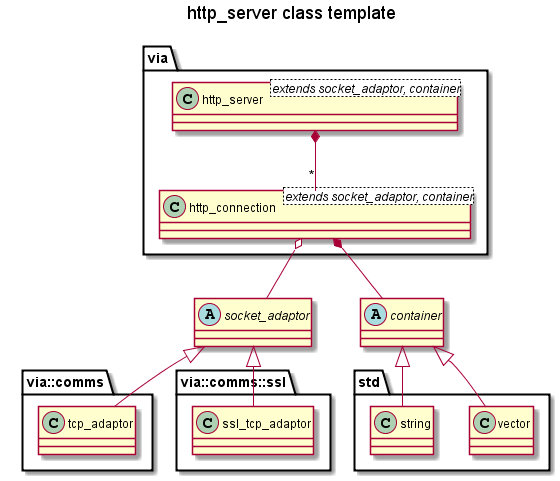

via-httplib: A C++ HTTP Library
===============================

A library for embedding HTTP or HTTPS, IPV6 and IPV4 servers in C++ applications.

`via-httplib` is an asynchronous C++ HTTP server built upon `boost asio` that
aims to provide a simple, secure, lightweight server that complies with the
requirements of [rfc2616](www.w3.org/Protocols/rfc2616/rfc2616.html)
wherever possible.

The heart of the library is `via::http_server`: a class template requiring
a `SocketAdaptor` to instantiate it:

 + a TCP/IP connection for a plain HTTP server
 + an SSL/TLS connection for an HTTPS server
  
The server can be configured to pass HTTP message bodies in different types of
containers, e.g.:

   + `std::vector<char>` (the default) for handing binary data, e.g. images, files, etc.
   + `std::string` for handing textural data, e.g. HTML, JSON, etc.
  
| Socket Adaptor    | Container         | Description                   |
|-------------------|-------------------|-------------------------------|
| `tcp_adaptor`     | `std::vector<char>`   | An HTTP data server.  |
| `tcp_adaptor`     | `std::string`     | An HTTP text server.          |
| `ssl_tcp_adaptor` | `std::vector<char>`   | An HTTPS data server. |
| `ssl_tcp_adaptor` | `std::string`     | An HTTPS text server.         |

For example the following code declares an plain HTTP server that passes data in a
`std::vector<char>`:

    #include "via/comms/tcp_adaptor.hpp"
    #include "via/http_server.hpp"
    
    typedef via::http_server<via::comms::tcp_adaptor> http_server_type;

Whether the server accepts IPV6 and IPV4 connections or just IPV4 connections
depends upon how the port is configured:

 + IPV6, (the default) the server accepts both IPV6 and IPV4 connections
 + IPV4 only, the server only accepts IPV4 connections

The HTTP message bodies can be sent either buffered or un-buffered using
"scatter-gather" writes for speed and memory efficiency.

| Document | Description |
|----------|-------------|
| [Build Guide](docs/MAKE.md) | How to build the library. |
| [Server User Guide](docs/Server.md) | How to use the library to create HTTP servers. |
| [Client User Guide](docs/Clients.md) | How to use the library to create HTTP clients. |
| [Security Guide](docs/Server_Security.md) | How to configure the library securely. |
| [Design](docs/Design.md) | The library design. |
| [examples/server](examples/server) | Example HTTP & HTTPS servers. |
| [examples/client](examples/client) | Example HTTP & HTTPS clients. |
  
Requirements
------------

+ The `boost` C++ library, especially `asio`, see [boost](http://www.boost.org/). Tested with version 1.57.

+ A C++ compiler. This is the C++03 version.  
It's currently tested with `MSVC 2013`, `GCC 4.9.1` and `MinGw 4.9.1` so backwards
compatibility cannot be guaranteed. Also please be aware of this warning from `boost`:
[old compilers](http://www.boost.org/users/news/old_compilers.html)  

+ For HTTPS, the `OpenSSL` library, see [openssl](http://www.openssl.org/).

+ For C++ code documentation, Doxygen, see [Doxygen](http://www.stack.nl/~dimitri/doxygen/)

Installing
----------

Download the latest tagged version of `via-httplib` from
[Github](https://github.com/kenba/via-httplib)
and follow the instructions here: [Make](docs/MAKE.md).  
Or simply build the .cpp files into your application (there are 8 of them).

`via-http` lib depends on the `boost` libraries.
If `boost` is not installed on your machine then download the latest package from
[boost](http://www.boost.org/) and follow the instructions here:
[boost getting started](http://www.boost.org/doc/libs/1_57_0/more/getting_started/index.html).

The `boost asio` library (and hence `via-httplib`) depends upon the
`OpenSSL` library to implement SSL/TLS sockets.
If you require an **HTTPS** server or client then you'll need to install the
`OpenSSL` library as well.
Please note that a plain HTTP server should *not* require `OpenSLL`.

If `OpenSLL` is not installed on your machine then download the latest stable
package from [openssl source](http://www.openssl.org/source/) and build it.
Note: a binary distribution may be available for your machine,
see: [OpenSSL binaries](http://www.openssl.org/related/binaries.html),
which could save you a lot of trouble, since building the `OpenSSL` binaries can
be a long-winded process...

Namespace Structure
-------------------

Directory Structure
-------------------

| Directory            | Contents                                                                 |
|----------------------|--------------------------------------------------------------------------|
| [via](via)           | The `via-httplib` API classes: [http_server](via/http_server.hpp), [http_connection](via/http_connection.hpp) and [http_client](http_client.hpp). |
| [examples/server](examples/server) | Example HTTP & HTTPS servers.                              |
| [examples/client](examples/client) | Example HTTP & HTTPS clients.                              |
| `tests`              | A unit tests for the HTTP parsers and encoders.                          |
| [docs](docs)         | The User Guides and design documents.                                    |
| `docs/html`          | [Doxygen](http://www.stack.nl/~dimitri/doxygen/) output directory. Created by running `doxygen Doxyfile` in the [docs](docs) directory. | 
