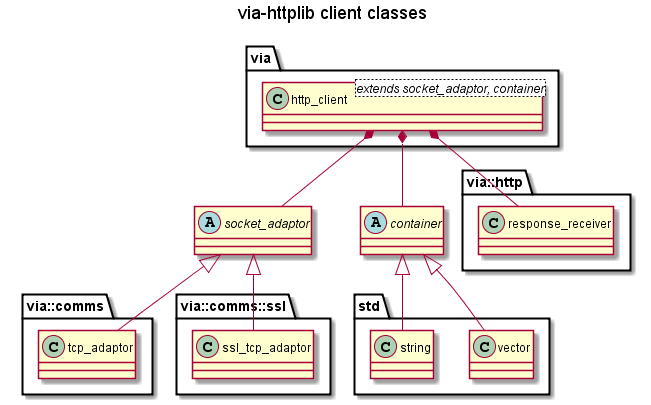
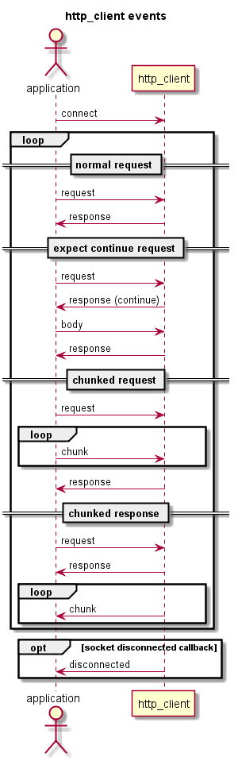

# HTTP Clients #

## Class Template `http_client` ##

An application can create HTTP clients using the `http_client` class template .

The `http_client` class template is defined in `<via/http_client.hpp>`:

    namespace via
    {
      template <typename S, typename T = std::vector<char>, bool use_strand = false>
      class http_client
      {
        ...
      }
    }

The template parameters are described below: 

| Parameter   | Default             | Description                            |
|-------------|---------------------|----------------------------------------|
| S           | None.               | The socket_adaptor: either via::comms::tcp_adaptor for HTTP, or via::comms::ssl::ssl_tcp_adaptor for HTTPS. |
| T           | `std::vector<char>` | The container to use for message bodies: `std::vector<char>` or `std::string` |
| use_strand  | false               | Enable an `asio::strand` to use multiple threads without explicit locking, see: [boost asio strands](http://www.boost.org/doc/libs/1_57_0/doc/html/boost_asio/overview/core/strands.html) |

### HTTP Client ###

For example the following code declares an plain HTTP client that passes data in a
`std::vector<char>` (the default).

    #include "via/comms/tcp_adaptor.hpp"
    #include "via/http_client.hpp"
    
    typedef via::http_client<via::comms::tcp_adaptor> http_client_type;
    
### HTTPS Client ###
    
The example below declares an HTTPS client that passes data in a `std::string`.

    #include "via/comms/ssl/ssl_tcp_adaptor.hpp"
    #include "via/http_client.hpp"
    
    typedef via::http_client<via::comms::ssl::ssl_tcp_adaptor, std::string> https_client_type;

An HTTPS client also requires the following:

 + the OpenSSL include files must be in the include path
 + the OpenSSL libraries must be built and linked in
 + The macro: HTTP_SSL must be defined.  
    
## Constructing the Client ##
    
No matter how the `http_client` class is parametrised, it can only be created
one way, using the `create` function:

    static shared_pointer create(boost::asio::io_service& io_service,
                                 ResponseHandler response_handler,
                                 ChunkHandler chunk_handler);

i.e. it must be created with a reference to a `boost::asio::io_service` and stored
in a `shared_pointer` for example:

    boost::asio::io_service io_service;
    http_client_type::shared_pointer
      http_client(http_client_type::create(io_service, response_handler, chunk_handler));
                         
Note: the `http_client` class instance must be constructed with a `boost::asio::io_service`
and the `io_service` must be run or polled after `http_client` has been initialised
to enable TCP communications.
For more information see: [boost libs](http://www.boost.org/doc/libs/): Asio.

The format of the ResponseHandler and ChunkHandler (and other types of event handlers)
are described in HTTP Clients Events below.
      
## HTTP Client Events ##

The `http_client` will signal the application whenever a significant event
occurs. Events that may be signalled are:

| Event                 | Callback Type     | Description                       |
|-----------------------|-------------------|-----------------------------------|
| Response Received     | ResponseHandler   | A valid HTTP response has been received. |
| Chunk Received        | ChunkHandler      | A valid HTTP chunk has been received. |
| Socket Disconnected   | ConnectionHandler | The socket has just disconnected. |

### Response Received Event ###

Response Received is signalled whenever an HTTP request is received from a server.

The application MUST handle this message (otherwise there was no point in
sending a request!), so a ResponseHandler for this event is required in the
http_client class template constructor.

The declaration of a `ResponseHandler` is:

    typedef std::function<void (http::rx_response const&, T const&)> ResponseHandler;

where:
    `T` is the second class template parameter, i.e. the container.
    
The example code below shows how to declare a response handler:

    /// The application's response handler.
    void response_handler(via::http::rx_response const& response,
                          std::string const& body)
    {
    ...
    }

The response handler is primarily how the application receives responses from
HTTP servers.

### Chunk Received Event ###

Chunk Received is signalled whenever an HTTP response chunk is received from a server.

Normally an application will receive the body with the response. However, from HTTP 1.1
onwards, both HTTP requests and responses may contain "chunked" bodies. In which case,
the body may be sent in a number of "chunks". The application may process the chunks as
they are received. However, a "chunked" HTTP response is not complete until the last
chunk has been received.

An application does not *need* to register a `chunk_handler` with `http_client`.
However, if the application doesn't register a handler for this event then
it cannot be considered an HTTP 1.1 client and will not be able to receive
HTTP `chunks` from a server.

The declaration of a `ChunkHandler` is:

    typedef std::function<void (http::rx_chunk<T> const&, T const&)> ChunkHandler;

where:
    `T` is the second class template parameter, i.e. the container.

The example code below shows how to declare a chunk handler:

    typedef http_client_type::chunk_type http_chunk_type;

    /// The application's chunk handler.
    void chunk_handler(http_chunk_type const& chunk, std::string const& data)
    {
    ...
    }

For information on chunks see: [Chunked Transfer Encoding](CHUNKS.md)

### Socket Disconnected Event ###

Socket Disconnected is signalled whenever the HTTP socket disconnects.

The declaration of a `ConnectionHandler` is:

    typedef std::function<void (void)> ConnectionHandler;

The example code below shows how to declare and register a disconnected handler:

    /// The application's disconnected handler.
    void disconnected_handler()
    {
    ...
    }

    /// register disconnected_handler with the http_client
    http_client->disconnected_event(disconnected_handler);

## Connecting to a Server ##

When all of the event handlers have been connected, the client can be connected to an
HTTP server and start sending requests. This is achieved by calling 'connect', e.g.:

    if (!http_client->connect(host_name))
    {
      std::cerr << "Error, could not resolve host: " << host_name << std::endl;
      return 1;
    }

After `connect` has been called, `run` may be called on the `asio::io_service`.

## Sending Requests ##

All HTTP requests are created from a instance of the `tx_request` class.

### Class `tx_request` ###

The `tx_request` class is defined in `<via/http/request.hpp>`.

The class has two Constructors:

    explicit tx_request(request_method::id method_id,
                        std::string uri,
                        std::string header_string = "",
                        int minor_version = 1,
                        int major_version = 1);
and

    explicit tx_request(const std::string& method,
                        std::string uri,
                        std::string header_string = "",
                        int minor_version = 1,
                        int major_version = 1);

The first constructor requires a `via::http::request_method::id`
and a uri string.
`request_method::id` is an enumeration of the standard HTTP request methods, see:
`<via/http/request_method.hpp>`

The second constructor requires a method string and a uri string.
It enables the application to send a non-standard HTTP request methods.

The other parameters are the same for both constructors and described below:  

 + `header_string`: a string containing one or more response headers.
    HTTP headers are just strings of the form "Header: Value\r\n" the application can
    set any number of headers in this string.
 + `minor_version`: the minor HTTP version number, set to zero for HTTP/1.0.
    Default 1 for HTTP/1.1.  
    Set to zero for HTTP/1.0
 + `major_version`: the major HTTP version number. Default 1 for HTTP/1.1.

There are also "set" and "add" functions in the `tx_request` class so that the 
headers and HTTP version can be set after the class has been constructed, i.e.:  

 + `void add_header(header_field::id field_id, const std::string& value)`  
    Add a standard HTTP header field (defined in `<via/http/header_field.hpp>`)
    to the request.
 + `void add_header(std::string const& field, const std::string& value)`  
    Add a non-standard header field  to the request.
 + `add_content_length_header(size_t size)`  
    Add a `Content-Length` header with the given size to the request.
 + `void set_minor_version(int minor_version)` Set the HTTP minor version.
 + `void set_major_version(int major_version)` Set the HTTP major version.

### The `Content-Length` Header ###

Although not required by [rfc2616](http://www.w3.org/Protocols/rfc2616/rfc2616.html),
some servers do not accept requests without a `Content-Length` Header, so the
`tx_request` class ensures that it (or a `Transfer-Encoding` header, see
[rfc2616](http://www.w3.org/Protocols/rfc2616/rfc2616.html) section 4.4 para 3)
is always present.

In short, this means an application need never set a `Content-Length` header in
`tx_request`.  
A `Content-Length` header should only be set with an `Expect: 100-continue` header,
to set the `Content-Length` size without a body.

### Sending Requests ###

All requests are sent via the `http_client`, e.g.:

    // Create an http request and send it to the host.
    via::http::tx_request request(via::http::request_method::id::GET, uri);
    http_client->send(request);

There are also functions for sending chunks, e.g.:

    std::string a_chunk("An HTTP message chunk");
    http_client->send_chunk(a_chunk);

And for sending a message body after a `100-continue` response, e.g.:

    std::string a_body("An HTTP message body");
    http_client->send_body(a_body);

## Examples ##

A simple HTTP Client:
[`simple_http_client.cpp`](examples/client/simple_http_client.cpp)

A simple HTTPS Client:
[`simple_https_client.cpp`](examples/client/simple_https_client.cpp)

A example HTTP Client with all of the handlers defined:
[`example_http_client.cpp`](examples/client/example_http_client.cpp)

An HTTP Client that sends a chunked request to PUT /hello:
[`chunked_http_client.cpp`](examples/client/chunked_http_client.cpp)
