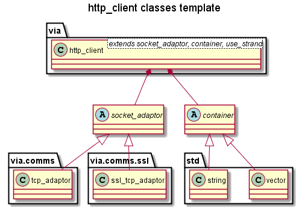

# HTTP Client User Guide #

An application create an HTTP client type by instantiating the `http_client` class template
defined in `<via/http_client.hpp>`:

    namespace via
    {
      template <typename SocketAdaptor, typename Container = std::vector<char> >
      class http_client
      {
        ...
      }
    }

The `http_client` class template parameters are:

| Parameter     | Default             | Description                            |
|---------------|---------------------|----------------------------------------|
| SocketAdaptor |                     | `via::comms::tcp_adaptor` for HTTP or `via::comms::ssl::ssl_tcp_adaptor` for HTTPS. |
| Container     | `std::vector<char>` |`std::vector<char>` for data or `std::string` for text |
 
 E.g. an HTTP client using std::string as a Container:
 
    #include "via/comms/tcp_adaptor.hpp"
    #include "via/http_client.hpp"
    
    typedef via::http_client<via::comms::tcp_adaptor, std::string> http_client_type;

## Constructing and Configuring a client ##

The client is constructed with an `asio::io_service`, a `ResponseHandler` and a
`ChunkHandler` e.g.:

    boost::asio::io_service io_service;
    http_client_type http_client(io_service, response_handler, chunk_handler);

Where `response_handler` is an instance of `ResponseHandler`, the event handler
for incoming HTTP responses, e.g.:

    /// The handler for incoming HTTP requests.
    /// Outputs the response.
    void response_handler(via::http::rx_response const& response,
                          std::string const& body)
    {
      std::cout << "Rx response: " << response.to_string()
                << response.headers().to_string();
      std::cout << "Rx body: "     << body << std::endl;

      if (!response.is_chunked())
        http_client->disconnect();
    }

And `chunk_handler` is an instance of `ChunkHandler`, the event handler
for incoming HTTP chunks, e.g.:

    /// The handler for incoming HTTP chunks.
    /// Outputs the chunk header and data to std::cout.
    void chunk_handler(http_chunk_type const& chunk, std::string const& data)
    {
      if (chunk.is_last())
      {
        std::cout << "Rx chunk is last, extension: " << chunk.extension()
                  << " trailers: " << chunk.trailers().to_string() << std::endl;
        http_client->disconnect();
      }
      else
        std::cout << "Rx chunk, size: " << chunk.size()
                  << " data: " << data << std::endl;
    }
    
### Client Events and Handlers ###
 
The client will call an application's event handlers (callback functions)
whenever a significant event occurs.  
See [Client Events](Client_Events.md) for more details. 

| Event                 | Function to Register Callback | Description              |
|-----------------------|-------------------------------|--------------------------|
| **Response Received** | Constructor                   | A valid HTTP response has been received. |
| **Chunk Received**    | Constructor                   | A valid HTTP chunk has been received. |
| Invalid Response      | invalid_response_event        | An invalid HTTP response has been received. |
| Socket Connected      | connected_event               | The socket is connected.  |
| Socket Disconnected   | disconnected_event            | The socket has disconnected.  |
| Message Sent          | message_sent_event            | A message has been sent on the connection. |

Note **Response Received** and **Chunk Received** are the only events for which
the application is required to provide an event handlers.
    
### Client Configuration ###

The application can then configure the client parameters.  
See [Client Configuration](Client_Configuration.md) for more details.  

Some of the more significant parameters (with their default values) are:

| Parameter         | Default | Description                                         |
|-------------------|---------|-----------------------------------------------------|
| max_body_size     | 4Gb     | The maximum size of a response body.                |
| max_chunk_size    | 4Gb     | The maximum size of each response chunk.            |
    
### HTTPS Client Configuration

Note: only valid for clients using `via::comms::ssl::ssl_tcp_adaptor` as a template parameter.

SSL/TLS options can be set via the ssl_context, e.g.:

    std::string certificate_file = "cacert.pem";
    boost::asio::ssl::context& ssl_context(https_client_type::connection_type::ssl_context());
    ssl_context.load_verify_file(certificate_file);
    
See: [asio ssl context base](http://www.boost.org/doc/libs/1_57_0/doc/html/boost_asio/reference/ssl__context_base.html)
for options.

## Making Connections ##

Once an `http_client` has been created and configured, it can connect to a server
by calling `connect` with the host name, e.g.:

    // attempt to connect to the host on the standard http port (80)
    if (!http_client->connect(host_name))
    {
      std::cout << "Error, could not resolve host: " << host_name << std::endl;
      return 1;
    }

The default parameter for `connect` is the default HTTP port: http.

Note: the `http_client` uses the host name to populate the HTTP request "host" header,
so the application does not need to set it.

## "Running" the Client ##

The clients's communication is handled by the `boost asio` library. For the client
to connect, `run` must be called on the`asio::io_service` to run the client,
see: [boost libs](http://www.boost.org/doc/libs/): Asio.

    // run the io_service to start communications
    io_service.run();

The client will call `response_handler` whenever it receives a valid HTTP response
or `chunk_handler` whenever it receives a valid HTTP chunk.
 
Note: the call to `io_service.run()` will not return until the connection is closed.  

## Sending Requests ##

The client normally creates an HTTP request in a `via::http::tx_request` class
passing it the request method id and the uri, e.g:

    via::http::tx_request request(via::http::request_method::id::GET, uri);

The request is then sent by calling one of the client's send functions, e.g.:

    http_client->send(request);
    
The client will be notified when the response is received by the `response_handler`
passed to the `http_client` constructor.

The client has an number of different `send` functions that the application may call:

| Function                     | Data         | Description                          |
|------------------------------|--------------|--------------------------------------|
| send(request)                |              | Send an HTTP `request` without a body. |
| send(request, body)          | Container    | Send a `request` with `body`, data **buffered** by `http_client`. |
| send(request, buffers)       | ConstBuffers | Send a `request` with `body`, data **unbuffered**. |
| send_body(body)              | Container    | Send request `body` data, **buffered** by `http_client`. |
| send_body(body, buffers)     | ConstBuffers | Send request `body` data, **unbuffered**. |
| send_chunk(data)             | Container    | Send request `chunk` data, **buffered** by `http_client`. |
| send_chunk(buffers, buffers) | ConstBuffers | Send request `chunk` data, **unbuffered**. |
| last_chunk()                 |              | Send request HTTP `last chunk`.  |

All of the functions send the data asynchronously, i.e. they return before the data
is sent. The application can choose between two types of functions depending upon
whether the data that it is sending is temporary or not:

 + **buffered** functions, i.e.: those taking a copy of Container as a parameter.
 These functions take a copy of the data so the data is no longer required after the
 function is called.
 
 + **unbuffered** functions, i.e.: those taking a ConstBuffers as a parameter.
 These functions take a `std::deque` of `asio::const_buffer`s that point to the data.
 Therefore the data must **NOT** be temporary. It must exist until the `Message Sent`
 event, see [Client Events](Client_Events.md).

## Examples ##

A simple HTTP Client:
[`simple_http_client.cpp`](examples/client/simple_http_client.cpp)

A simple HTTPS Client:
[`simple_https_client.cpp`](examples/client/simple_https_client.cpp)

A example HTTP Client with all of the handlers defined:
[`example_http_client.cpp`](examples/client/example_http_client.cpp)

An HTTP Client that sends a chunked request to PUT /hello:
[`chunked_http_client.cpp`](examples/client/chunked_http_client.cpp)
