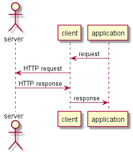
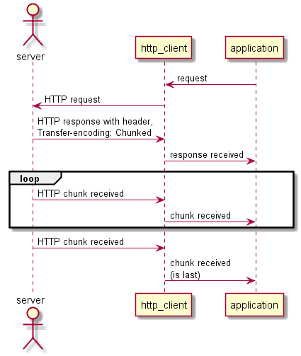

# HTTP Client Events #

The client will call an application's event handlers (callback functions)
whenever a significant event occurs.  

| Event                 | Handler Type      | Description                        |
|-----------------------|-------------------|------------------------------------|
| **Response Received** | ResponseHandler   | An HTTP response has been received.|
| Chunk Received        | ChunkHandler      | An HTTP chunk has been received.   |
| Socket Connected      | ConnectionHandler | The socket is connected.           |
| Socket Disconnected   | ConnectionHandler | The socket has disconnected.       |
| Message Sent          | ConnectionHandler | A message has been sent over the socket. |

Note **Response Received** is the only event that the application is required to
provide an event handler for.

### Response Received ###

Response Received is signalled whenever an HTTP response is received from a server.
The application is required to provide an event handler for this event.

The declaration of a `ResponseHandler` is:

    typedef std::function<void (http::rx_response const&, Container const&)> ResponseHandler;

where:
    `Container` is the type of Container to use: `std::vector<char>` or `td::string`.
    
E.g.:

    /// The application's response handler.
    void response_handler(via::http::rx_response const& response,
                          std::string const& body)
    {
    ...
    }

The `ResponseHandler` for the Response Received event is passed as a parameter in the 
`http_client` constructor.

### Chunk Received ###

Normally an application will receive a message body with the response. However, from HTTP 1.1
onwards, both HTTP requests and responses may contain "chunked" bodies see: [Chunked Transfer Encoding](Chunks.md).

Where a server sends a chunked response the mesasge body is sent in a number of "chunks".
According to RFC2616 an application cannot be considered HTTP 1.1 compliant
if it can't receive chunked messages.

The declaration of a `ChunkHandler` is:

    typedef std::function<void (http::rx_chunk<T> const&, Container const&)> ChunkHandler;

where:
    `Container` is the type of Container to use: `std::vector<char>` or `td::string`.

The example code below shows how to declare a chunk handler:

    typedef http_client_type::chunk_type http_chunk_type;

    /// The application's chunk handler.
    void chunk_handler(http_chunk_type const& chunk, std::string const& data)
    {
    ...
    }

The `ChunkHandler` for the Chunk Received event is passed as a parameter in the 
`http_client` constructor.

### Socket Connected ###

Socket Connected is signalled when the HTTP socket connects.
Note: HTTP requests can only be sent whilst the socket is connected.

If the application wishes to know when a socket is connected it can call
socket_connected_event to register a ConnectionHandler.

The declaration of a `ConnectionHandler` is:

    typedef std::function<void (void)> ConnectionHandler;

The example code below shows how to declare and register a connected handler:

    /// The application'sconnected handler.
    void connected_handler()
    {
    ...
    }

    /// register connected_handler with the http_client
    http_client->connected_event(disconnected_handler);

### Socket Disconnected ###

Socket Disconnected is signalled whenever the HTTP socket disconnects.

If an application wishes to know when a socket is disconnected it can call
socket_disconnected_event to register a ConnectionHandler.
The ConnectionHandler will be called when the socket is disconnected.

The format of the `ConnectionHandler` is shown in **Socket Connected** above.

### Message Received ###

This event is signalled when the client has finished sending the last message
over the socket.

The format of the `ConnectionHandler` is shown in **Socket Connected** above.
