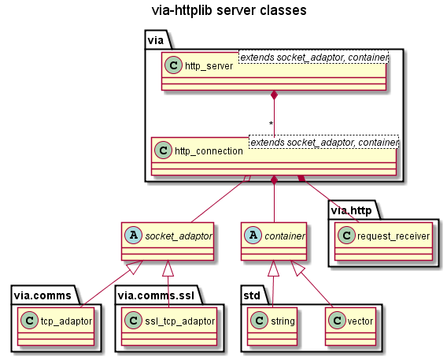

# Design #

The via-httplib library consists of three parts:  

 1. [Tcp and Ssl communications software in namespace `via::comms`](Design_comms.md)
 2. [The HTTP parser/encoder in namespace `via::http`](Design_HTTP.md)
 3. HTTP server, connection and client API in namespace `via`  
 

The parser/encoder in via::http is completely independent of the communications
code in via::comms. They have been designed to provide a foundation for the
servers in the via namespace, but they can be used on their own if that is all
that’s required.

Detailed design on `via::http` and `via::comms` can be found by following the links above.

## The HTTP server library `via` ##

### Requirements ###

By default, the HTTP server shall implement the HTTP 1.1 protocol as defined
in [rfc2616](http://www.w3.org/Protocols/rfc2616/rfc2616.html).

It accepts TCP or SSL connections from HTTP clients and then
responds to each HTTP request in turn, i.e. it does not close the connection
after it has responded. However, it shall close the connection if:

+ it is responding to a request from an HTTP 1.0 (or lower) client.  
+ the client requests that the server closes the connection after its response.  
+ the client does not send a request within a given timeout period.  

Each connection shall be managed independently. The server shall:
 
+ Forward requests to the application when complete: i.e. all of the HTTP
headers and the associated body (only if Content-Length > 0) have been received
or just all of the HTTP headers when using chunked Transfer-Encoding.  
+ Forward ‘chunks’ when each chunk is complete.  
+ Enable the application to send its response asynchronously.   

The only exception to this is the response to a request message with a “HEAD”
method. The server should respond to this request message precisely as it
would to a request message with a “GET” method for the same resource. However,
although the response message may contain a “Content-Length” message header,
it MUST NOT contain any data, i.e. a message body.

### Design ###
      
The HTTP server consists of:

+ `http_connections` i.e. connections with an HTTP request parser and an HTTP
response encoder.  
+ an `http_server` to manage the http_connections.

Like the comms connections and server, the HTTP connections and server are
implemented as template classes instantiated with a `SocketAdaptor` for the type
of comms socket required and a `Container` for the type of buffer to use
(default `std::vector` of `char`).

TODO add client description

#### Use of `shared_ptr` and `weak_ptr` ####

A key feature of the connections is that they can only be created as shared
pointers. This is to manage the ownership of the connections. The
connection class constructor is declared private so that all client connections
must be created as shared pointers using the create factory method. Also the
server class maintains its connections in a collection of shared pointers.
Therefore only the caller of a connection create method or a server owns each
connection.

To enforce this ownership model, the signals (aka callback functions) that can
be sent by the connections (`event_signal_type` and `error_signal_type`, see
`connection.hpp`) contain weak pointers to the connection that originated them.

Therefore if the shared pointer to a connection is freed (e.g. by the owner
detecting a disconnect) before the user of a signal has had a chance to use the
weak pointer, then the call to lock() on the weak pointer (to get the shared
pointer) will return an empty pointer.

This is a fundamental feature of the design. It is vital that whenever the
connection pointers are stored beyond the lifetime of a callback function,
that they are stored as weak pointers NOT shared pointers. Otherwise the
application may attempt to use a resource that no longer exists!
