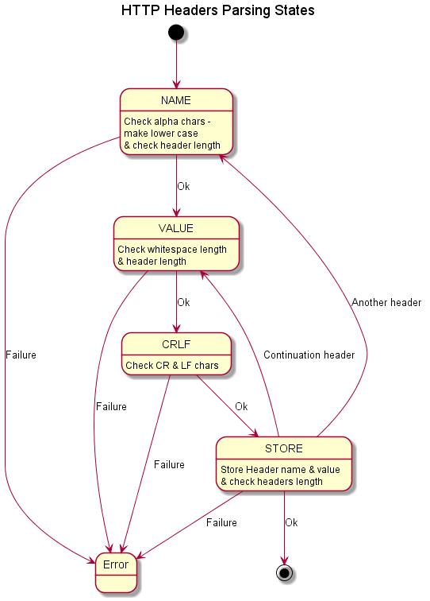

# The HTTP parsing/encoding library `via::http` #

## Requirements ##

The Hypertext Transfer Protocol (HTTP) is a text based application level
messaging protocol.

A client sends a request message to a server to obtain or modify a resource.
A server sends a response message back to the client, either with the resource
or a reason why it hasn't responded as requested.

The protocol has three types of message:  
1.	A request, sent from a client to a server.  
2.	A response, sent from a server to a client.  
3.	A chunk, a chunk of data which may be part of a request or a response.  

And four types of header:  
1.	A request start line, e.g. GET /blah/blah HTTP/1.1\r\n  
2.	A response start line, e.g. HTTP/1.1 200 OK\r\n  
3.	A chunk start line, e.g. 2bf;\r\n  
4.	A message header, e.g. Content-Length: 336  

Although text based, the protocol is quite strict on what's allowed and what
isn't (see [rfc2616](http://www.w3.org/Protocols/rfc2616/rfc2616.html)).

## Design  ##

For efficiency and simplicity, the request and response message parsers parse
the input data one character at a time. They keep track of their current
location with the HTTP message using a state machine so that they can handle
requests and responses where an HTTP message is divided across multiple
message packets.

[HTTP Requests](Design_HTTP_Request.md)

[HTTP Responses](Design_HTTP_Response.md)

The parsed message headers (for both requests and responses) are stored in a
map of strings. The message header field names are converted to lower case
whilst the message header is being parsed. rfc2616 states that the header
field names are case-insensitive, so converting them all to lower case and
storing them in a map, makes searching for a specific header field relatively
simple and efficient. Note: the message header values are stored as they are
received and are NOT converted to lower-case.

The encoding message headers (for both requests and responses) are simply
stored in a std::string. This allows the user to control the order in
which message headers are sent. Note: rfc2616 is a bit ambiguous over this;
it states that the headers should be sent in a certain order, but then it also
states that the receiver shouldn't care about the order...
