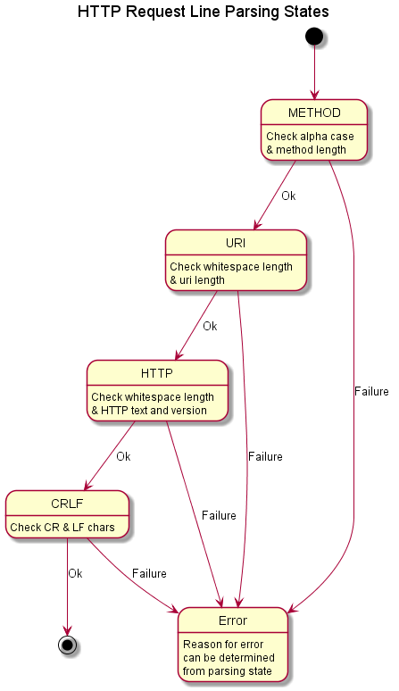
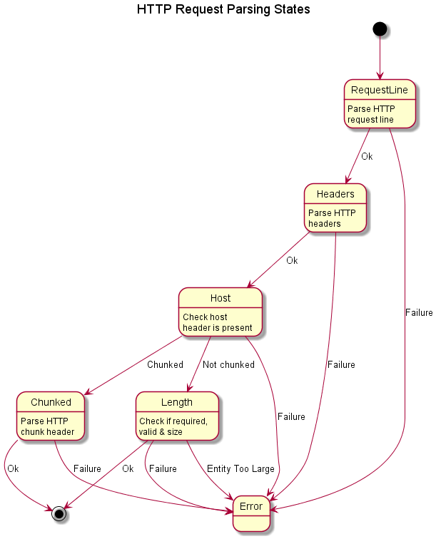

# HTTP Requests #

The library has different classes for receiving and transmitting requests.
The `request.hpp` header file contains: 
 
+ class `tx_request` for constructing an HTTP request for an HTTP client to send.  
+ class `rx_request` for parsing an HTTP request for an HTTP server.

## Request Parsing ##

A **request** message must always start with a request start line followed by any
number of message header lines and blank line.

Where a request (or response) message contains data in the body of the message,
it must have a **Content-Length** message header containing the size in octets
(another word for bytes) of the data. Otherwise, if the data is to be sent in
chunks, the request or response message must have a **Transfer-Encoding** message
header containing the word **Chunked**.

Where a request or response message contains chunked data, each chunk of data
must be preceded by a **chunk** header, which is just a line before the data with
the size of the data (in a hex string).
