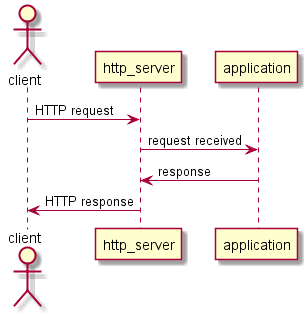
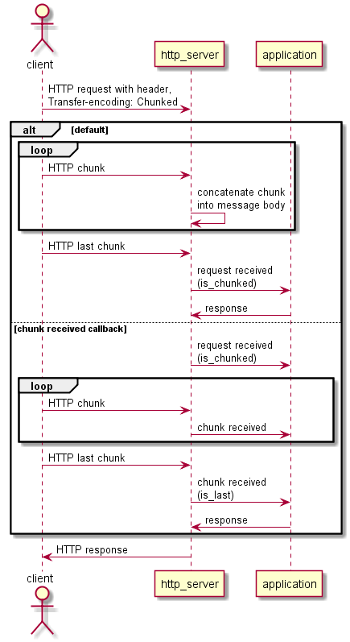
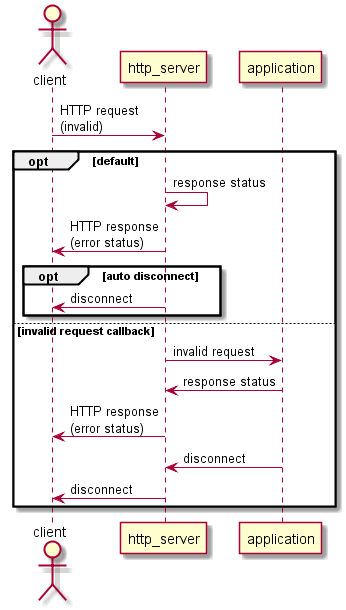

# HTTP Server Events #

The `http_server` will signal the application whenever a significant event
occurs. Events that may be signalled are:

| Event                 | Handler Type      | Description                    |
|-----------------------|-------------------|----------------------------------|
| **Request Received**  | RequestHandler    | A valid HTTP request has been received. |
| Chunk Received        | ChunkHandler      | A valid HTTP chunk has been received. |
| Expect Continue       | RequestHandler    | A valid HTTP request header has been received containing "Expect: 100-continue" |
| Invalid Request       | RequestHandler    | An invalid HTTP request has been received. |
| Socket Connected      | ConnectionHandler | A socket has connected. |
| Socket Disconnected   | ConnectionHandler | A socket has disconnected. |
| Message Sent          | ConnectionHandler | A message has been sent on the connection. |

Note **Request Received** is the only event that the application is required to
provide an event handler for.

## Request Received ##

A Request Received event is signalled whenever the server receives a valid
HTTP request from a client.  
The application is required to provide an event handler for this event.

The declaration of a `RequestHandler` is:

    typedef std::function<void (std::weak_ptr<http_connection_type>,
                                http::rx_request const&,
                                Container const&)> RequestHandler;
where:
    `http_connection_type` is the http_connection class template instantiated
    with the same parameters as `http_server` and `Container` is the type of
    Container to use: `std::vector<char>` or `std::string`.
    
E.g.:

    /// Define the server's http_connection_type to simplify the code.
    typedef http_server_type::http_connection_type http_connection;

    /// The application's request handler.
    void request_handler(http_connection::weak_pointer weak_ptr,
                         via::http::rx_request const& request,
                         std::vector<char> const& body)
    {
    ...
    }
    
The `RequestHandler` for the Request Received event is passed as a parameter
in the `http_server` constructor.

## Chunk Received ##

Normally an application will receive the message body with a request. However, HTTP 1.1
requests and responses may contain "chunked" bodies, see: [Chunked Transfer Encoding](Chunks.md).
According to RFC2616 an HTTP 1.1 server **MUST** be able to handle chunked requests.  

A "chunked" HTTP request is not complete until the last chunk has been received.
So to enable an application to receive chunks without registering a handler,
`via-httplib` concatenates the received chunks into a single body and notifies
the application when the last chunk has been received.

To the application it just appears as if a normal request has been received with a
(probably large) message body, see the default case in the diagram below.

Note: if an application does **NOT** register a `chunk_handler` then the maximum total size of
the chunked body is max_body_size, see: [Server Configuration](Server_Configuration.md).

Where an application expects to receive large message bodies or just wishes to
receive chunk events, it can call `chunk_received_event` to register a
`ChunkHandler` to be called whenever a chunk is received.

The declaration of a `ChunkHandler` is:

    typedef std::function<void (std::weak_ptr<http_connection_type>,
                                http::rx_chunk<Container> const&,
                                Container const&)> ChunkHandler;

where:
    `http_connection_type` is the http_connection class template instantiated
    with the same parameters as `http_server` and ``Container` is the type of
    Container to use: `std::vector<char>` or `std::string`.
    
The application's chunk handler must match the function signature defined by
`ChunkHandler` above.  
The example below shows how to declare and register a chunk handler:

    // Define the server's http_connection_type & chunk_type to simplify the code.
    typedef http_server_type::http_connection_type http_connection;
    typedef http_server_type::chunk_type http_chunk_type;

    // The application's chunk handler.
    void chunk_handler(http_connection::weak_pointer weak_ptr,
                       http_chunk_type const& chunk,
                       std::vector<char> const& data)
    {
    ...
    }

    // register chunk_handler with the http_server
    http_server.chunk_received_event(chunk_handler);

Note: if an application registers a `chunk_handler` and it receives a chunked request,
then it must send an HTTP response to the client when the last chunk of the request
is received, **not** in the request handler. See: `example_http_server.cpp`.  

## Expect 100 Continue ##

Normally an application will send one response to each request that it receives.
However, an HTTP client may send a request with an "Expect: 100-Continue" header,
in which case it expects the server to send a `100 Continue` response (or an error
response) before it sends the body of the request.

To enable an application to receive the request body without registering a handler
to respond to the `expect continue` request, `via-httplib` normally sends a
`100 Continue` response to a request containing an "Expect: 100-Continue" header.

An application may handle the `expect continue` request by calling 
`request_expect_continue_event` to register a RequestHandler to be called
whenever an `expect continue` request is received.

The format of the `RequestHandler` is shown above in the **Request Received** section.

If the application registers a handler for this event, then it must determine
whether to send `100 Continue` or a different response to the client in the
expect continue RequestHandler.  
For example in the `expect_continue_handler` below, the application responds
to all requests with a body greater than 1Mb with a "413 Request Entity Too
Large" response:

    void expect_continue_handler(http_connection::weak_pointer weak_ptr,
                                 via::http::rx_request const& request,
                                 std::vector<char> const& body)
    {
      static const size_t MAX_LENGTH(1048576);

      // Reject the message if it's too big, otherwise continue
      via::http::tx_response response((request.content_length() > MAX_LENGTH) ?
                           via::http::response_status::REQUEST_ENTITY_TOO_LARGE :
                           via::http::response_status::CONTINUE);
      weak_ptr.lock()->send(response);
    }

    /// register expect_continue_handler with the http_server
    http_server.request_expect_continue_event(expect_continue_handler);

## Invalid Request ##

RFC2616 defines a set of appropriate responses for an HTTP server to send
to an invalid HTTP request. Unfortunately, RFC2616 couldn't foresee all of
the ways in which the protocol would be misused, see: [Security Guide](Server_Security.md).  

An invalid request may be a sign that the HTTP server is subject a
Denial of Service (DoS) attack.
In which case the application may wish to be handle it in a different way
to the standard RFC2616 response, e.g. by disconnecting the client's connection. 

To comply with RFC2616 the default server behaviour to an invalid request
is to send the appropriate response from RFC2616.  
To provide slightly more protection from DoS attacks, the server can be
configured to disconnect immediately after sending a response to an
invalid request, see below.

For security the application should call `request_invalid_event` to register a
`RequestHandler` to be called whenever an invalid request is received.

The format of the `RequestHandler` is shown above in the **Request Received** section.

An example `invalid_request_handler` is shown below that outputs the address
of the client, sends the default response and disconnects the connection:

    void invalid_request_handler(http_connection::weak_pointer weak_ptr,
                                 via::http::rx_request const& request,
                                 std::vector<char> const& body)
    {
      http_connection::shared_pointer connection(weak_ptr.lock());
      if (connection)
      {
         std::cout << "Invalid request from: << connection->remote_address() << std::endl;

         connection->send(); // send the default RFC2616 response
         connection->disconnect(); // close the client connection
      }
    }
    
    ...

    // register invalid_request_handler with the http_server
    http_server.invalid_request_event(invalid_request_handler);

If the application registers a handler for this event, then the application
must respond to the client and/or close the connection.
    
## Socket Connected ##

The server creates a new http_connection whenever a new socket is connected.

If an application wishes to know when a new socket is connected it can call
`socket_connected_event` to register a `ConnectionHandler`.

The declaration of a `ConnectionHandler` is:

    typedef std::function<void (std::weak_ptr<http_connection_type>)> ConnectionHandler;
where:
    `http_connection_type` is the http_connection class template instantiated
    with the same parameters as `http_server`.
    
E.g.:

    void connection_handler(http_connection::weak_pointer weak_ptr)
    {
      std::cout << "New connection from: << weak_ptr.lock()->remote_address() << std::endl;
    }

## Socket Disconnected ##

The server destroys the http_connection whenever a socket is disconnected.

If an application wishes to know when a socket is disconnected it can call
`socket_disconnected_event` to register a `ConnectionHandler`. The
`ConnectionHandler` will be called just before the http_connection is destroyed.

The format of the `ConnectionHandler` is shown in **Socket Connected** above.

## Message Sent ##

This event is signalled when the server has finished sending the last message
on the connection.

The format of the `ConnectionHandler` is shown in **Socket Connected** above.
 