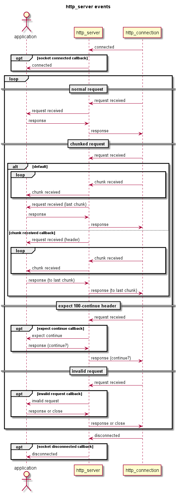

# HTTP Server User Guide #

## Class Template `http_server` ##

An application creates an HTTP server type by instantiating the `http_server`
class template.

The `http_server` class template is defined in `<via/http_server.hpp>`:

    namespace via
    {
      template <typename S, typename T = std::vector<char>, bool use_strand = false>
      class http_server
      {
        ...
      }
    }

The template parameters are described below: 

| Parameter   | Default             | Description                            |
|-------------|---------------------|----------------------------------------|
| S           | None.               | The socket_adaptor: either via::comms::tcp_adaptor for HTTP, or via::comms::ssl::ssl_tcp_adaptor for HTTPS. |
| T           | `std::vector<char>` | The container to use for message bodies: `std::vector<char>` or `std::string` |
| use_strand  | false               | Enable an `asio::strand` to use multiple threads without explicit locking, see: [boost asio strands](http://www.boost.org/doc/libs/1_57_0/doc/html/boost_asio/overview/core/strands.html) |

### HTTP Server ###

For example the following code declares an plain HTTP server that passes data in a
`std::vector<char>` (the default).

    #include "via/comms/tcp_adaptor.hpp"
    #include "via/http_server.hpp"
    
    typedef via::http_server<via::comms::tcp_adaptor> http_server_type;
      
### HTTPS Server ###

The example below declares an HTTPS server that passes data in a `std::string`.

    #include "via/comms/ssl/ssl_tcp_adaptor.hpp"
    #include "via/http_server.hpp"
    
    typedef via::http_server<via::comms::ssl::ssl_tcp_adaptor, std::string> https_server_type;

An HTTPS server also requires the following:

 + the OpenSSL include files must be in the include path
 + the OpenSSL libraries must be built and linked in
 + The macro: HTTP_SSL must be defined.  
 + The password must be set (if required)
 + The locations of the certificate file, key file (and optional dh_file) must be set.

The password and file locations can be set by calling the following functions
after the http_server has been constructed and before `accept_connections`:

    void set_password(std::string const& password);

    static boost::system::error_code set_ssl_files(const std::string& certificate_file,
                                                   const std::string& key_file,
                                                   std::string        dh_file = "");

for example:

    std::string password         = "test";
    std::string certificate_file = "cacert.pem";
    std::string private_key_file = "privkey.pem";

    https_server.set_password(password);
    boost::system::error_code error
        (https_server_type::set_ssl_files(certificate_file, private_key_file));
    if (error)
    {
      std::cerr << "Error: "  << error.message() << std::endl;
      return 1;
    }
    
## Constructing the Server ##
    
The http_server class constructor requires a `boost::asio::io_service` and
a handler for HTTP request messages to create an HTTP server instance, i.e.:

    explicit http_server(boost::asio::io_service& io_service, RequestHandler request_handler);

The format of the RequestHandler (and other types of event handlers)
is described in HTTP Server Events below.

All the event handlers should be registered before connecting the server to
a port.

### Connecting the Server to a Port ###

When all of the event handlers have been connected and the SSL password
and files have been set, the server can be connected to a port and start
listening for client connections on the relevant protocol (IPv4 or IPv6).
This is achieved by calling `accept_connections`.

The `accept_connections` method is defined as:

    boost::system::error_code accept_connections
                      (unsigned short port = SocketAdaptor::DEFAULT_HTTP_PORT,
                       bool ipv6 = false);

The default parameters create an IPV4 server on the default HTTP port, i.e. `port 80`
for an HTTP server or `port 443` for an HTTPS server.

They can be overridden to create a server on any port using either the IPV4 or IPV6
protocol.  

    boost::system::error_code error(the_http_server.accept_connections());
    if (error)
    {
      std::cerr << "Error: "  << error.message() << std::endl;
      return 1;
    }

The default parameters create an IPV4 server on the default HTTP port, i.e. `port 80`
for an HTTP server or `port 443` for an HTTPS server.
They can be overridden to create a server on any port using either the IPV4 or IPV6
protocol.  

The function returns a boost::system::error_code to determine whether the server was
able to open the TCP acceptor successfully. If successful, a test against error will
return false, otherwise error.message() may be called to determine the type of error
as in the example above.

### "Running" the Server ###

The server's communication is handled by the `boost asio` library. For the server
to start accepting connections, `run` must be called on the`asio::io_service` to
run the server, see: [boost libs](http://www.boost.org/doc/libs/): Asio.

    // run the io_service to start communications
    io_service.run();

#### Asio Strands and Thread Pools ####

The `asio io_service` may be used concurrently. In particular multiple threads may
call io_service::run() to set up a pool of threads from which completion handlers
may be invoked, see: [Threads and Boost.Asio](http://www.boost.org/doc/libs/1_57_0/doc/html/boost_asio/overview/core/threads.html)

`asio` provides `strands` to enable the execution of code in a multi-threaded
program without the need for explicit locking, see:
[Strands: Use Threads Without Explicit Locking](http://www.boost.org/doc/libs/1_57_0/doc/html/boost_asio/overview/core/strands.html)

`strand wrapping` of the completion handlers can be enabled in `via::http_server`
by setting the use_strand flag in the template, see above.  
A thread pool may be used instead of calling `io_service.run()` as follows:

	std::vector<std::shared_ptr<std::thread>> threads;
	for(auto i = no_of_threads; i > 0; --i)
	  threads.push_back(std::make_shared<std::thread>([&io_service]() { io_service.run(); }));
	
	// Wait for all threads in the pool to exit.
	for (auto& thread : threads)
	  thread->join();

## HTTP Server Events ##

The `http_server` will signal the application whenever a significant event
occurs. Events that may be signalled are:

| Event                 | Callback Type     | Description                    |
|-----------------------|-------------------|----------------------------------|
| Request Received      | RequestHandler    | A valid HTTP request has been received. |
| Chunk Received        | ChunkHandler      | A valid HTTP chunk has been received. |
| Expect Continue       | RequestHandler    | A valid HTTP request header has been received containing "Expect: 100-continue" |
| Invalid Request       | RequestHandler    | An invalid HTTP request has been received. |
| Socket Connected      | ConnectionHandler | A new socket has just connected. |
| Socket Disconnected   | ConnectionHandler | A socket has just disconnected. |

### Request Received ###

Request Received is signalled whenever a valid HTTP request is received
from a client.

The application MUST respond to this request, so a RequestHandler for this
event is required in the http_server class template constructor.

The declaration of a `RequestHandler` is:

    typedef std::function<void (std::weak_ptr<http_connection_type>,
                                http::rx_request const&,
                                T const&)> RequestHandler;
where:
    `http_connection_type` is the http_connection class template instantiated
    with the same parameters as `http_server` and `T` is the second class template
    parameter.
    
An example request handler:

    /// Define the server's http_connection_type to simplify the code.
    typedef http_server_type::http_connection_type http_connection;

    /// The application's request handler.
    void request_handler(http_connection::weak_pointer weak_ptr,
                         via::http::rx_request const& request,
                         std::vector<char> const& body)
    {
    ...
    }

### Chunk Received ###

Normally an application will receive the body with the request. However, HTTP 1.1
requests and responses may contain "chunked" bodies, see: [Chunked Transfer Encoding](CHUNKS.md).

According to RFC2616 an HTTP 1.1 server MUST be able to handle chunked requests. 
However, a "chunked" HTTP request is not complete until the last chunk has been
received. By default `via-httplib` concatenates the received chunks into a
single body and notifies the application when the last chunk has been received.
So to the application it just appears as if a normal request has been received.

However, if an application wishes to handle the chunks itself, it can call
`chunk_received_event` to register a ChunkHandler to be called whenever an
HTTP chunk is received from a client.

The declaration of a `ChunkHandler` is:

    typedef std::function<void (std::weak_ptr<http_connection_type>,
                                http::rx_chunk<T> const&,
                                T const&)> ChunkHandler;

where:
    `http_connection_type` is the http_connection class template instantiated
    with the same parameters as `http_server` and `T` is the second class template
    parameter.
    
The application's chunk handler must match the function signature defined by
`ChunkHandler` above. The example code below shows how to declare and register
a chunk handler:

    /// Define the server's http_connection_type & chunk_type to simplify the code.
    typedef http_server_type::http_connection_type http_connection;
    typedef http_server_type::chunk_type http_chunk_type;

    /// The application's chunk handler.
    void chunk_handler(http_connection::weak_pointer weak_ptr,
                       http_chunk_type const& chunk,
                       std::vector<char> const& data)
    {
    ...
    }

    /// register chunk_handler with the http_server
    http_server.chunk_received_event(chunk_handler);

Note: if an application registers a `chunk_handler` and it receives a chunked request,
then it must send an HTTP response to the client when the last chunk of the request
is received, **not** in the request handler. See: `example_http_server.cpp`.  

### Expect 100 Continue ###

Normally an application should only send one response to each request that it receives.  
However, an HTTP client may send a request with an "Expect: 100-continue" header,
in which case it expects the server to send a `100 Continue` response (or an error
response) before it sends the body of the request.

By default `via-httplib` sends a `100 Continue` response whenever it receives
a request containing an "Expect: 100-continue" header.

However, if an application wishes to respond to the "Expect: 100-continue" header
itself, then it can call `request_expect_continue_event` to register a
RequestHandler to be called whenever an "Expect: 100-continue" header is received
from a client.

The format of the `RequestHandler` is shown above.

If the application registers a handler for this event, then it must determine
whether to send `100 Continue` or a different response to the client in the
expect continue RequestHandler.  
For example in the `expect_continue_handler` below, the application responds
to all requests with a body greater than 1Mb with a "413 Request Entity Too
Large" response:

    void expect_continue_handler(http_connection::weak_pointer weak_ptr,
                                 via::http::rx_request const& request,
                                 std::vector<char> const& body)
    {
      static const size_t MAX_LENGTH(1048576);

      // Reject the message if it's too big, otherwise continue
      via::http::tx_response response((request.content_length() > MAX_LENGTH) ?
                           via::http::response_status::REQUEST_ENTITY_TOO_LARGE :
                           via::http::response_status::CONTINUE);
      weak_ptr.lock()->send(response);
    }

    /// register expect_continue_handler with the http_server
    http_server.request_expect_continue_event(expect_continue_handler);

### Invalid Request ###

RFC2616 defines a set of appropriate responses for an HTTP server to send
to an invalid HTTP request. Unfortunately, RFC2616 didn't foresee some of
the ways in which the protocol would be misused, see: [HTTP Security](SECURITY.md).  
An invalid request may be a signal that the HTTP server is subject a
Denial of Service (DoS) attack and so the application may wish to be
informed so that it can handle it in a different way to the standard RFC2616
response, e.g. by disconnecting the client's connection. 

By default `via-httplib` will send the appropriate response from RFC2616
whenever it receives an invalid HTTP request.

However, if an application wishes to respond an invalid HTTP request
itself, then it can call `request_invalid_event` to register a
`RequestHandler` to be called whenever an invalid request is received
from a client.

The format of the `RequestHandler` is shown above.

If the application registers a handler for this event, then the application
must either respond to the client or close the connection, e.g.:

    void invalid_request_handler(http_connection::weak_pointer weak_ptr,
                                 via::http::rx_request const& request,
                                 std::vector<char> const& body)
    {
      http_connection::shared_pointer connection(weak_ptr.lock());
      if (connection)
      {
         std::cout << "Invalid request from: << connection->remote_address() << std::endl;

         if (strict_security) // example application flag
           connection->close(); // close the client connection
         else
           connection->send(); // send the RFC2616 default response
      }
    }

    /// register expect_continue_handler with the http_server
    http_server.request_expect_continue_event(expect_continue_handler);

### Socket Connected ###

By default `via-httplib` just creates a new http_connection whenever a new
socket is connected.

However, if an application wishes to know when a new socket is connected,
then it can call `socket_connected_event` to register a `ConnectionHandler`
to be called whenever a new socket is connected.

The declaration of a `ConnectionHandler` is:

    typedef std::function<void (std::weak_ptr<http_connection_type>)> ConnectionHandler;
where:
    `http_connection_type` is the http_connection class template instantiated
    with the same parameters as `http_server`.
    
E.g.:

    void connection_handler(http_connection::weak_pointer weak_ptr)
    {
      std::cout << "New connection from: << weak_ptr.lock()->remote_address() << std::endl;
    }

    
### Socket Disconnected ###

By default `via-httplib` just destroys the http_connection whenever a socket
is disconnected.

However, if an application wishes to know when a socket is disconnected,
then it can call `socket_disconnected_event` to register a `ConnectionHandler`
to be called whenever a socket is disconnected before the http_connection is
destroyed.

The format of the `ConnectionHandler` is shown above.
    
## Server Options ##

| Parameter       | Default | Description                                         |
|-----------------|---------|-----------------------------------------------------|
| buffer_size     | 8192    | The maximum size of the receive buffer (in bytes).  |
| translate_head  | true    | Translate a HEAD request into a GET request.        |
| require_host    | true    | HTTP 1.1 Requests must include a Host header field. |
| trace_enabled   | false   | Echo back a TRACE request as per RFC2616.             |

### `buffer_size`

The maximum size of the receive buffer default 8192 bytes.

### `translate_head`

An HTTP HEAD request is identical to a GET request except that the server
**MUST NOT** return a message-body in the response, see:
[rfc2616](http://www.w3.org/Protocols/rfc2616/rfc2616.html) section 9.4.  

If set, then the server passes HEAD requests to the application as GET requests.  
Note: http_server **never** sends a body in a response to a HEAD request.

### `require_host`

A client **MUST** include a Host header field in all HTTP/1.1 request messages,
see: [rfc2616](http://www.w3.org/Protocols/rfc2616/rfc2616.html) section 14.23.  

If set, then the server enforces this rule on all HTTP 1.1 requests.

### `trace_enabled`

The standard HTTP response to a TRACE request is that it should echo back the
TRACE message and all of it's headers in the body of the response, see:
[rfc2616](http://www.w3.org/Protocols/rfc2616/rfc2616.html) section 9.8.  

However, although required by RFC2616 it's considered a security vulnerability 
nowadays, so the default behaviour is to send a 405 "Method Not Allowed" response
instead.

## Examples ##

An HTTP Server that incorporates the example code above:
[`example_http_server.cpp`](examples/server/example_http_server.cpp)

An HTTPS Server that incorporates the example code above:
[`example_https_server.cpp`](examples/server/example_https_server.cpp)

An HTTP Server that uses `asio` strand wrapping and a thread pool: [`thread_pool_http_server.cpp`](examples/server/thread_pool_http_server.cpp)

